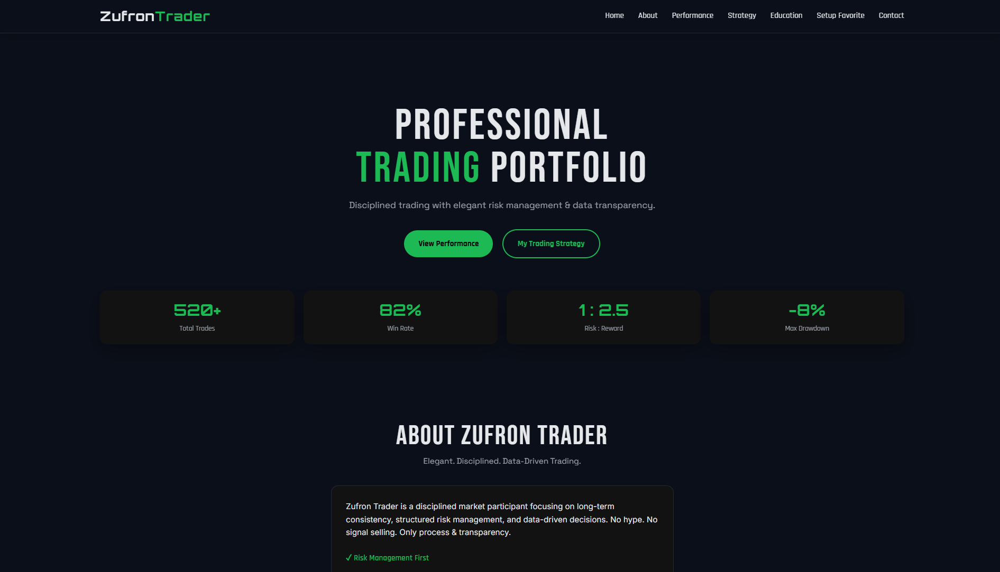
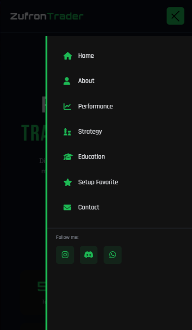
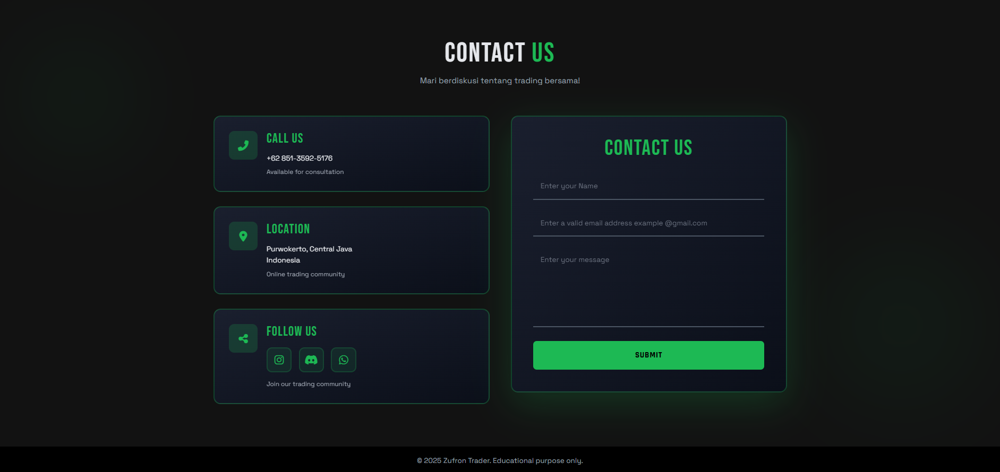

# 🎓 Zufron Trader Academy Web  
### **“Belajar Trading Dengan Cara yang Lebih Cerdas, Terarah, dan Terpercaya.”**
**Kolaborasi Official antara Zufron Trader Academy × BriellaYB**

---

### 🔰 Status Build  

### ⭐ Additional Badges  

---

## 🚀 Tentang Proyek
Website resmi **Zufron Trader Academy**, dibangun untuk:

- Menampilkan profil & aktivitas akademi  
- Memberikan edukasi dasar trading  
- Menyediakan akses ke kelas, komunitas, dan layanan  
- Menjadi pusat informasi utama  

Fokus pengembangan:  
- Desain modern & elegan  
- Fully responsive  
- Branding kuat  
- Kode bersih  
- Menggunakan **Tailwind CSS**  

---

## 💡 Why Choose This Website?

✨ **Desain Profesional** – Dibangun dengan pendekatan UI/UX modern  
⚡ **Super Cepat** – File ringan, load kilat  
📱 **Responsif Total** – Mobile, tablet, desktop semua mulus  
🎨 **Tailwind Powered** – Styling elegan & presisi  
🧭 **Navigasi Simpel** – User dapat menemukan informasi dengan mudah  
🛠️ **Mudah Dikembangkan** – Struktur project rapi dan scalable  

---

## ✨ Fitur Utama

- 🌟 Landing Page menarik  
- 📂 Informasi lengkap academy  
- 📞 Kontak mudah & cepat  
- 📱 Navigasi mobile-friendly  
- 🎯 CTA yang jelas  
- 🔧 Built with Tailwind CSS  

---

## 📸 Preview Website

 

 

  
✨ **Dibangun dengan passion oleh BriellaYB × Zufron Trader Academy** ✨  

